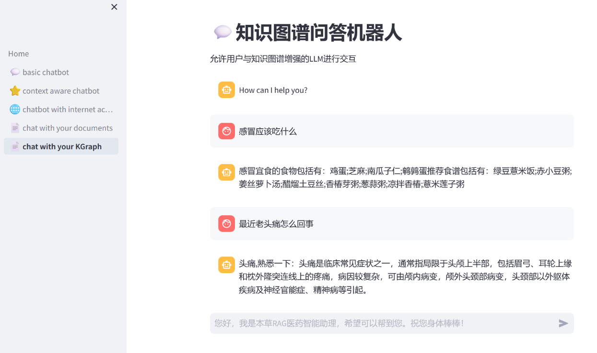

# 🌿Bencao RAG Medical Intelligent Assistant [(README_CN)](README_CN.md)

🌿The Bencao RAG Medical Intelligent Assistant is a powerful AI-based medical knowledge question-answering system, designed to enhance user experience in knowledge-intensive tasks by integrating context awareness, internet access, knowledge graphs, and retrieval-augmented generation. This system allows even users with limited knowledge of large models to easily explore unknown information and enjoy the convenience and fun it offers.

The project’s graphical interface is built using Streamlit. Streamlit is an open-source Python framework for data scientists and AI/ML engineers to quickly deliver dynamic data apps with just a few lines of code. You can build and deploy powerful data apps in minutes. Learn more about Streamlit at [Streamlit Documentation](https://docs.streamlit.io/).

<p align="center">
  
</p>

## Features

The Bencao RAG Medical Intelligent Assistant supports the following features:

### 💬 Basic Medical Q&A
Engage with users in interactive conversations, providing basic medical information services, such as explanations of common symptoms and basic treatment recommendations.

### ⭐ Context-Aware Medical Q&A
The assistant can remember previous medical-related conversations with the user and provide more relevant medical advice based on the context.

### 🌐 Internet-Enhanced Medical Q&A
With internet access, the system can answer queries related to the latest medical research, drug updates, or medical news.

### 📄 Document-Enhanced Medical Q&A
Supports access to user-uploaded medical records, medical literature, and clinical guidelines, providing accurate medical answers based on the referenced information.

### 🕸️ Medical Knowledge Graph-Based Q&A System
This component generates answers based on traditional methods using a medical knowledge graph, without relying on large models, to fulfill specific medical query requirements. **Note**: Since the underlying medical knowledge graph data is in Chinese, the Medical Knowledge Graph-Based Q&A System currently only supports question-answering in Chinese.

### 🧀 Knowledge Graph-Augmented Medical Q&A
Uses the medical knowledge graph to provide deeper, more structured responses to medical inquiries, such as drug interactions, relationships between symptoms and treatment plans, etc.

## Installation Steps

### 1. Install Dependencies
First, install the required libraries for the project:
```sh
pip install -r requirements.txt
```

### 2. Set Up Neo4j
- Download Neo4j: [Neo4j Download Center](https://neo4j.com/download-center/)
- Run Neo4j and access the page at: [http://localhost:7474](http://localhost:7474) (or port 7687)
- Set up the username and password; the default credentials are `neo4j` for both the username and password (choose `bolt` for the connection type).

### 3. Configure OpenAI API-KEY
Set your `api_key`, `api_base` (default doesn’t need configuration), and `model` type in `utils.py`:
```
    openai_api_key = ""
    openai_api_base = ""
    model = "gpt-3.5-turbo"
```

### 4. Build the Knowledge Graph
- Import the knowledge graph data (source: [QASystemOnMedicalKG GitHub](https://github.com/liuhuanyong/QASystemOnMedicalKG)):
    ```sh
    python KGraph/python/build_medicalgraph.py
    ```
    This process will take several hours.

  - Before importing the data, make sure to update the following with the correct connection protocol, username, and password:
    - Class `AnswerSearcher` (KGraph/answer_search.py)
    - Class `MedicalGraph` (KGraph/build_medicalgraph.py)
    - `enhanced_graph` (pages/6_🧀_kGraph_enhanced_chatbot.py)
    ```
    self.g = Graph(
        "bolt://localhost:7687",  # Use the bolt protocol for connection
        auth=("neo4j", "your_password")  # Provide the username and password
    )
    ```
    ```
    enhanced_graph = Neo4jGraph(url="bolt://localhost:7687", username="neo4j",
                            password="your_password", enhanced_schema=True)
    ```

### 5. Run Bencao RAG
- Activate the virtual environment:
    ```sh
    activate xxx
    ```

- Run the `Home.py` file:
    ```sh
    streamlit run Home.py
    ```

## Conclusion

🌿 The Bencao RAG Medical Intelligent Assistant leverages advanced large models and knowledge graph technologies to provide users with comprehensive, accurate, and personalized medical information services. Whether it's answering basic medical questions or handling complex medical queries, this system meets user needs and helps them explore and utilize medical knowledge more effectively.

## 💁 Contributing

We plan to add more chatbot examples over time. Contributions are welcome! When submitting a pull request (PR), please create a new branch for your changes instead of modifying the master branch directly.
